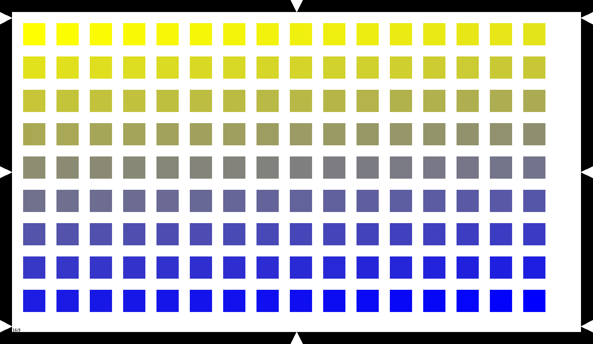

# Leesa

## Introduction

Leesa is an open-source software for image and video processing.

## Updates
- [2021-12-23] Leesa v0.0.1 is released.

## Getting Started

An example of usage for chart with single color and without border:

``` shell
from leesa.chart import Chart

ct = Chart(frame_size='HD', width=50, height=50, offset=25, offset_at_start=True, border=False, color_background=(255, 255, 255))
ct.chart_rectangles(color_mode='single_color', color=[[0, 255, 0]], image_name='img/out/single_color.png', json_name='img/out/single_color.json')
```
The output image will be:


An example of usage for chart with single color and border:

``` shell
from leesa.chart import Chart

ct = Chart(frame_size='HD', width=50, height=50, offset=25, offset_at_start=True, border=True, color_background=(255, 255, 255))
ct.chart_rectangles(color_mode='single_color', color=[[0, 255, 0]], image_name='img/out/single_color.png', json_name='img/out/single_color.json')
```
The output image will be:


An example of usage for chart with gradient color and border:

``` shell
from leesa.chart import Chart

ct = Chart(frame_size='HD', width=50, height=50, offset=25, offset_at_start=True, border=True, color_background=(255, 255, 255))
ct.chart_rectangles(color_mode='gradient_color', color=[[255, 255, 0], [0, 0, 255]], image_name='img/out/gradient_color.png', json_name='img/out/gradient_color.json')
```

The output image will be:




### class Chart

Parameters:

|name        |type  | meaning                                                         |
|------------|------|-----------------------------------------------------------------|
|frame_size  | str  | image size                     |
|width       | int  | rectangle width                     |
|height      | int  | rectangle height                    |
|offset      | int  | offset size between rectangles                    |
|offset_at_start  | bool  | TRUE or FALSE; offset to start first rectangle on left top corner                     |
|border      | bool  | FALSE or TRUE; draw border and pointers                     |
|color_background  | tuple  | color as RGB list, be default is [0, 0, 0]                    |


Accepted frame_size resolutions:

|name               | Resolution (WxH) | Ratio |
|-------------------|------------------|-------|
| QQVGA       | 160, 120        |   4:3    |
| SXGA        | 1280, 1024        |   5:4    |
| XGA         | 1024, 768        |   4:3    |
| SXGAminus   | 1280, 960        |   4:3    |
| s2592   | 2592, 1944        |   4:3    |
| WXGA_1152   | 1152, 768        |   3:2    |
| WXGA_1280   | 1280, 800        |   16:10    |
| HD   | 1280, 720        |   16:9    |
| FHD   | 1920, 1080        |   16:9    |
| s1440   | 1440, 720        |   18:9    |
| s2560   | 2560, 1080        |   21:9    |

### function Chart.chart_rectangles

Create chart and save image and JSON files.

        :param color_mode: 'single_color' - all rectangles will be same color, 'gradient_color' - colors will be interpolated between first and last colors.
        :param color: color as RGB list, for 'simple' - [R, G, B], for 'ramp' - [[R0, G0, B0], [R1, G1, B1]]
        :param image_name: output image file name
        :param json_name: output JSON file name
        :return: chart image as numpy array

Parameters:

|name        |type  | meaning                                                         |
|------------|------|-----------------------------------------------------------------|
|color_mode  | str  | 'single_color' - all rectangles will be same color, 'gradient_color' - colors will be interpolated between first and last colors.                     |
|color       | list  | color as RGB list, for 'single_color' - [R, G, B], for 'gradient_color' - [[R0, G0, B0], [R1, G1, B1]]                     |
|image_name      | str  | rectangle height                    |
|json_name      | str  | offset size between rectangles                    |
