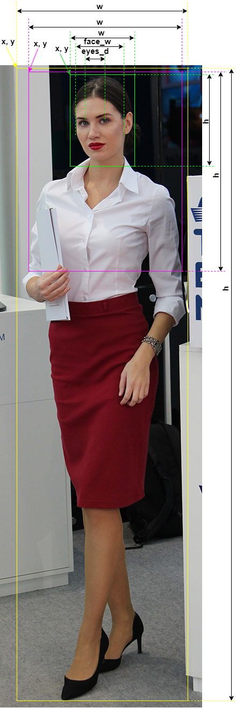
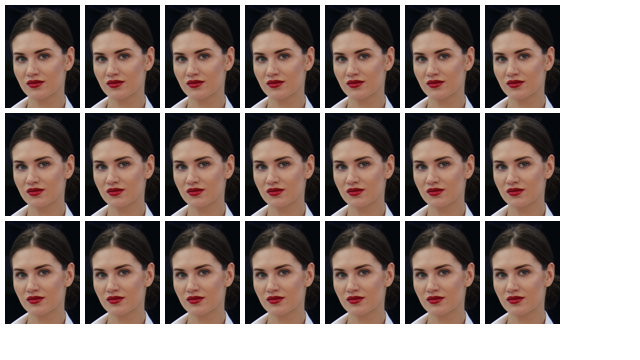
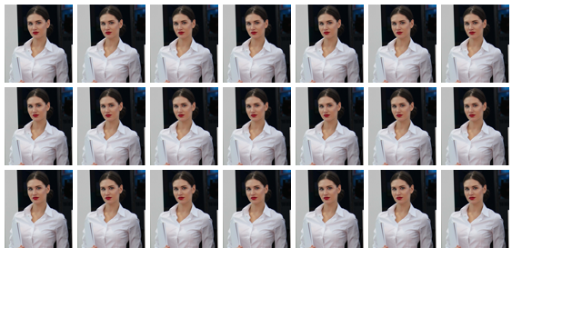
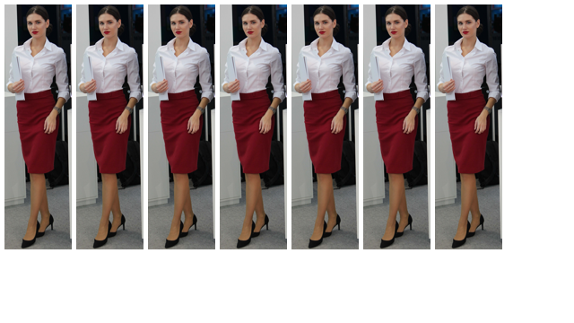

# Leesa

<!---  --->

Leesa is an open-source software for image and video processing.

Contents
========

* [Why?](#why)
* [Resolution](#resolution)
* [Usage for demosaic chart creation](#usage-for-demosaic-chart-creation)
* [Usage for edge chart creation](#usage-for-edge-chart-creation)
* [Data preparation for human detection](#data-preparation-for-human-detection)
* [Usage for face detection chart](#usage-for-face-detection-chart)
* [Usage for human detection chart](#usage-for-human-detection-chart)
* [Estimation of distance to human](#estimation-of-distance-to-human)
* [Estimation of intersection between floor and FOV](#estimation-of-intersection-between-floor-and-fov) 

## Why?

I wanted a tool that allows you to:

+ Test the performance of your demosaic algorithm for a raw image.
+ Test the performance of your edge detection algorithm for a rgb image.
+ Test the performance of your human detection algorithm for a rgb image.
+ Estimate the distance between human detection and camera.

## Resolution

Accepted frame_type resolutions:

|name         | Resolution (WxH)  |  Ratio   |
|-------------|-------------------|----------|
| QQVGA       | 160, 120          |   4:3    |
| nHD         | 640, 360          |   16:9   |
| VGA         | 640, 480          |   4:3    |
| SVGA        | 800, 600          |   4:3    |
| XGA         | 1024, 768         |   4:3    |
| WXGA_1152   | 1152, 768         |   3:2    |
| HD          | 1280, 720         |   16:9   |
| WXGA_1280   | 1280, 800         |   16:10  |
| SXGAminus   | 1280, 960         |   4:3    |
| SXGA        | 1280, 1024        |   5:4    |
| s1440       | 1440, 720         |   18:9   |
| HD+         | 1600, 900         |   16:9   |
| UXGA        | 1600, 1200        |   4:3    |
| WSXGA+      | 1680, 1050        |   16:10  |
| FHD         | 1920, 1080        |   16:9   |
| WUXGA       | 1920, 1200        |   16:10  |
| CMV2000     | 2048, 1088        |   17/9   |
| QWXGA       | 2048, 1152        |   16:9   |
| QXGA        | 2048, 1536        |   4:3    |
| OS04E10     | 2048, 2048        |   1:1    |
| OS03B10     | 2304, 1296        |   16:9   |
| s2560       | 2560, 1080        |   21:9   |
| QHD         | 2560, 1440        |   16:9   |
| WQXGA       | 2560, 1600        |   16:10  |
| IMX675      | 2592, 1944        |   16:9   |
| IMX664      | 2688, 1520        |   16:9   |
| OS05A10     | 2688, 1944        |   4:3    |
| IMX178      | 3096, 2080        |   16:9   |
| UWQHD       | 3440, 1440        |   21:9   |
| 4K_UHD      | 3840, 2160        |   16:9   |
| OS08C10     | 3872, 2192        |   16:9   |
| CMV12000    | 4096, 3072        |   4:3    |
| IMX294      | 4168, 2176        |   17:9   |
| OS12D40     | 4512, 2512        |   17:9   |
| CMV20000    | 5120, 3840        |   4:3    |
| IMX571      | 6244, 4168        |   3:2    |
| CMV50000    | 7920, 6004        |   4:3    |
| IMX455      | 9568, 6380        |   3:2    |
| CHR70M      | 10000, 7096       |   4:3    |


## Usage for demosaic chart creation

An example of usage for chart with single color and without border:

``` shell
from leesa.chart import Chart

ct = Chart(frame_type='HD', color_background=(255, 255, 255))
ct.rectangles(color_mode='single_color',
              rectangle_color=[[0, 255, 0]],
              border=False,
              image_name='img/out/single_color.png',
              json_name='img/out/single_color.json')
```

The output image will be:


An example of usage for chart with single color and border:

``` shell
from leesa.chart import Chart

ct = Chart(frame_type='HD', color_background=(255, 255, 255))
ct.rectangles(color_mode='single_color',
              rectangle_color=[[0, 255, 0]],
              border=True,
              image_name='img/out/single_color.png',
              json_name='img/out/single_color.json')
```

The output image will be:


An example of usage for chart with gradient color and no border:

``` shell
from leesa.chart import Chart

ct = Chart(frame_type='HD', color_background=(255, 255, 255))
ct.rectangles(color_mode='gradient_color',
              rectangle_color=[[255, 255, 0], [0, 0, 255]],
              border=False,
              image_name='img/out/gradient_color.png',
              json_name='img/out/gradient_color.json')

```

The output image will be:


An example of usage for chart with ramp colors:

``` shell
from leesa.chart import Chart

    ct = Chart(frame_type='nHD', color_background=(127, 127, 127))

    ct.ramps(image_name='img/out/ramps.png',
             json_name='img/out/ramps.json')

```

The output image will be:


An example of usage for converting RGB to Bayer images:

``` shell
from leesa.chart import Chart

    ct = Chart(frame_type='nHD', color_background=(127, 127, 127))

    ct.ramps(image_name='img/out/ramps.png',
             json_name='img/out/ramps.json')
    # for RGGB Bayer type
    rgb_to_bayer(image_name='img/out/ramps.png', dir_name='img/out', bayer_type='RGGB')
    # for BGGR Bayer type
    rgb_to_bayer(image_name='img/out/ramps.png', dir_name='img/out', bayer_type='BGGR')
    # for X-TRANS Bayer type
    rgb_to_bayer(image_name='img/out/ramps.png', dir_name='img/out', bayer_type='X-TRANS')
```

An example of usage for chart with color combinations:

``` shell
from leesa.chart import Chart

    ct = Chart(frame_type='nHD', color_background=(127, 127, 127))
    
    ct.combinations(image_name='img/out/combinations.png',
                    json_name='img/out/combinations.json')

```

The output image will be:


## Usage for edge chart creation

An example of usage for chart for edge detection test:

``` shell
from leesa.chart import Chart

    ct = Chart(frame_type='FHD', color_background=(127, 127, 127))
    ct.edge_test(image_name='img/out/edge_test.png',
                    json_name='img/out/edge_test.json')

```

The output image will be:


### Chart parameters


### class Chart

Parameters:

|name        |type  | meaning                                                           |
|------------|------|-------------------------------------------------------------------|
|frame_type  | str  | frame type                                                        |
|color_background  | tuple  | color as RGB list, be default is [0, 0, 0]                        |

### function Chart.chart_rectangles

Create chart and save image and JSON files.

Parameters:

| name             |type  | meaning                                                                                                                           |
|------------------|------|-----------------------------------------------------------------------------------------------------------------------------------|
| color_mode       | str  | 'single_color' - all rectangles will be same color, 'gradient_color' - colors will be interpolated between first and last colors. |
| rectangle_color  | list  | color as RGB list, for 'single_color' - [R, G, B], for 'gradient_color' - [[R0, G0, B0], [R1, G1, B1]]                            |
| rectangle_width  | int  | rectangle width                                                                                                                   |
| rectangle_height | int  | rectangle height                                                                                                                  |
| start_x          | int  | an x offset to start first rectangle from the left top corner                                                                     |
| start_y          | int  | an y offset to start first rectangle from the left top corner                                                                     |
| gap_x            | int  | x distance between 2 rectangles                                                                                                   |
| gap_y            | int  | y distance between 2 rectangles                                                                                                   |
|border      | bool  | FALSE or TRUE; draw border and pointers                                                                                           |
| image_name       | str  | image file name to save                                                                                                           |
| json_name        | str  | json file name to save                                                                                                            |

## Data preparation for human detection

Rename your image (for example: sample_0.jpg). Create the JSON file with same name (for example: sample_0.json).
Add to JSON file the x, y coordinates of the detection rectangle, width and height of the detection rectangle, face width, and distance between eyes.

For example the JSON data will be:
``` shell
[
	{"obj":"face", "x": 672, "y": 42, "w": 970, "h": 1134, "face_w": 460, "eyes_d": 236}
]
```

The face image width will be scaled by using the 'scale' and 'scale_size' parameters and parameter 'scale mode'. 
For example: 'scale' = 10 and 'scale_size' = 4, the calculation is: 'detection rectangle width' = 'scale' * 'scale_size' = 10 * 4 = 40

The 3 modes for scaling is used (parameter 'scale_mode'):
* 0 - scale by the detection rectangle width or 'w'
* 1 - scale by the width of the face or 'face_w'
* 2 - scale by the distance between eyes or 'eyes_d'

An image below explains the JSON fields for Face detection.


For example the JSON data will be:
``` shell
[
	{"obj":"face", "x": 512, "y": 62, "w": 512, "h": 704, "face_w": 342, "eyes_d": 146},
	{"obj":"head_shoulders", "x": 134, "y": 66, "w": 1280, "h": 1472},
	{"obj":"figure", "x": 134, "y": 66, "w": 1280, "h": 4672}	
]
```
An image below explains the JSON fields for Face, Head and Shoulder, and FIgure detections.



## Usage for face detection chart

An example of usage for face detection test:

``` shell
from leesa.odchart import ODChart

ct = ODChart(frame_type='nHD', color_background=(255, 255, 255))
ct.f_to_one_image(dir_img='tests/data_sample/sample_0/',
                  dir_json='tests/data_sample/sample_0/',
                  dir_out='img/out',
                  scale_size=4,
                  scales= [55, 45, 35, 25, 15],
                  scale_mode=0)

```

The output image will be:


The output JSON file will be:
``` shell
{"exporter":"Leesa Exporter v0.1.6","time":"07-Feb-2024(17-35-26-429641)","type":"object detection",
 "scale_size":4,"detect_type":"face","scale_mode":0,
 "objects":[{"x":0,"y":0,"w":220,"h":257,"scale":55},  {"x":225,"y":0,"w":180,"h":210,"scale":45},
           {"x":420,"y":0,"w":140,"h":163,"scale":35}, {"x":450,"y":175,"w":100,"h":116,"scale":25},
           {"x":255,"y":225,"w":60,"h":70,"scale":15}]
}
```

## Usage for human detection chart

An example of usage for human detection test:

``` shell
from leesa.odchart import ODChart

ct = ODChart(frame_type='nHD', color_background=(255, 255, 255))
ct.object_to_images(dir_img='tests/data_sample/sample_2/',
                    dir_json='tests/data_sample/sample_2/',
                    dir_out='img/out',
                    scales=[15],
                    scale_size=5
                    )
```
The output image for Face will be:



The output JSON file will be:
``` shell
{"exporter":"Leesa Exporter v0.1.8","time":"23-Feb-2024(15-02-30-319928)",
"type":"object detection","scale_size":5,"detect_type":"face","objects":[
{"x":5,"y":5,"w":75,"h":103,"scale":15},{"x":85,"y":5,"w":75,"h":103,"scale":15},
{"x":165,"y":5,"w":75,"h":103,"scale":15},{"x":245,"y":5,"w":75,"h":103,"scale":15},
{"x":325,"y":5,"w":75,"h":103,"scale":15},{"x":405,"y":5,"w":75,"h":103,"scale":15},
{"x":485,"y":5,"w":75,"h":103,"scale":15},{"x":5,"y":113,"w":75,"h":103,"scale":15},
{"x":85,"y":113,"w":75,"h":103,"scale":15},{"x":165,"y":113,"w":75,"h":103,"scale":15},
{"x":245,"y":113,"w":75,"h":103,"scale":15},{"x":325,"y":113,"w":75,"h":103,"scale":15},
{"x":405,"y":113,"w":75,"h":103,"scale":15},{"x":485,"y":113,"w":75,"h":103,"scale":15},
{"x":5,"y":221,"w":75,"h":103,"scale":15},{"x":85,"y":221,"w":75,"h":103,"scale":15},
{"x":165,"y":221,"w":75,"h":103,"scale":15},{"x":245,"y":221,"w":75,"h":103,"scale":15},
{"x":325,"y":221,"w":75,"h":103,"scale":15},{"x":405,"y":221,"w":75,"h":103,"scale":15},
{"x":485,"y":221,"w":75,"h":103,"scale":15}]}
```

The output image for Head and Shoulders will be:



The output JSON file will be:
``` shell
{"exporter":"Leesa Exporter v0.1.8","time":"23-Feb-2024(15-02-30-344933)",
"type":"object detection","scale_size":5,"detect_type":"head_shoulders","objects":[
{"x":5,"y":5,"w":75,"h":86,"scale":15},{"x":85,"y":5,"w":75,"h":86,"scale":15},
{"x":165,"y":5,"w":75,"h":86,"scale":15},{"x":245,"y":5,"w":75,"h":86,"scale":15},
{"x":325,"y":5,"w":75,"h":86,"scale":15},{"x":405,"y":5,"w":75,"h":86,"scale":15},
{"x":485,"y":5,"w":75,"h":86,"scale":15},{"x":5,"y":96,"w":75,"h":86,"scale":15},
{"x":85,"y":96,"w":75,"h":86,"scale":15},{"x":165,"y":96,"w":75,"h":86,"scale":15},
{"x":245,"y":96,"w":75,"h":86,"scale":15},{"x":325,"y":96,"w":75,"h":86,"scale":15},
{"x":405,"y":96,"w":75,"h":86,"scale":15},{"x":485,"y":96,"w":75,"h":86,"scale":15},
{"x":5,"y":187,"w":75,"h":86,"scale":15},{"x":85,"y":187,"w":75,"h":86,"scale":15},
{"x":165,"y":187,"w":75,"h":86,"scale":15},{"x":245,"y":187,"w":75,"h":86,"scale":15},
{"x":325,"y":187,"w":75,"h":86,"scale":15},{"x":405,"y":187,"w":75,"h":86,"scale":15},
{"x":485,"y":187,"w":75,"h":86,"scale":15}]}
```

The output image for Figure will be:



The output JSON file will be:
``` shell
{"exporter":"Leesa Exporter v0.1.8","time":"23-Feb-2024(15-02-30-398438)",
"type":"object detection","scale_size":5,"detect_type":"figure","objects":[
{"x":5,"y":5,"w":75,"h":273,"scale":15},{"x":85,"y":5,"w":75,"h":273,"scale":15},
{"x":165,"y":5,"w":75,"h":273,"scale":15},{"x":245,"y":5,"w":75,"h":273,"scale":15},
{"x":325,"y":5,"w":75,"h":273,"scale":15},{"x":405,"y":5,"w":75,"h":273,"scale":15},
{"x":485,"y":5,"w":75,"h":273,"scale":15}]}
```
## Estimation of distance to human

Required parameters: focal length, sensor name or frame type with sensor diagonal size.

Supported Sony, Omnivision, Hamamatsu, AMS sensors:

|resolution  | Sensors  |
|------------|----------|
| < 2M       | S13101, S14501 |
| 2-3M       | IMX482LQJ, IMX662-AAQR, IMX462LQR, IMX327LQR, IMX307LQD, OS02C10, OS02G10, OS02H10, OS02N10, OS03B10, OV2718, OV2732, OV2735, CMV2000 |
| 4-6M       | IMX664-AAQR1, IMX464LQR_LQR1, IMX347LQR, IMX178LQJ, IMX675-AAQR, IMX335LQN, OS04A10, OS04C10, OS04D10, OS04E10, OS04L, OS05A10, OS05A20, OS05B, OV4689, CMV4000 |
| 7-8M       | IMX585-AAQJ1, IMX485LQJ_LQJ1, IMX678-AAQR1, IMX715-AAQR1, IMX515-AAQN, IMX415-AAQR, OS08A10, OS08A20, OS08C10  |
| 9-20M      | IMX294CJK, OS12D40, CMV12000, CMV20000 |
| 21-30M     | IMX571BQR-J |
| > 31M      | IMX455AQK-K, CMV50000, CHR70M |

The 3 modes for estimation is used (parameter 'smode'):
* 0 - estimation by the distance between eyes or 'eyes_d'
* 1 - estimation by the width of the face or 'face_w'
* 2 - estimation by human height 'human_h'

An example of the distance estimation between human and camera

``` shell
from leesa.camera import *
from leesa.human import *

# An example of usage for distance estimation
sr = Sensor(sensor_name='IMX482LQJ')
os = Optics(focal_length=4e-03)
c = Camera(sensor=sr, optics=os)
h = Human()
r = h.camera_to_distance(eyes_d=146, cam=c, mode=0) # by eyes distance
print(r)
r = h.camera_to_distance(face_w=342, cam=c, mode=1) # by face width
print(r)
r = h.camera_to_distance(human_h=4672, cam=c, mode=2) # by human height
print(r)
# An example of usage for focal length estimation
r = h.distance_to_focal(eyes_d=146, cam=c, distance=0.3, mode=0) # by eyes distance
print(r)
r = h.distance_to_focal(face_w=342, cam=c, distance=0.3, mode=1) # by face width
print(r)
r = h.distance_to_focal(human_h=4672, cam=c, distance=0.3, mode=2) # by human height
print(r)
# An example of usage for pixel size estimation
r = h.distance_to_pixels(distance=0.5, cam=c, mode=0)
print('distance between eyes in pixels = ', r)
r = h.distance_to_pixels(distance=0.5, cam=c, mode=1)
print('face width in pixels = ', r)
r = h.distance_to_pixels(distance=0.5, cam=c, mode=2)
print('human height in pixels = ', r)
```

## Estimation of intersection between floor and FOV

Required parameters: focal length, sensor name or frame type with sensor diagonal size, camera altitude, and camera pitch angle.

Image below shows the camera pitch angle and altitude


An example of the intersection estimation between floor and camera FOV

``` shell
from leesa.camera import *

sr = Sensor(sensor_name='IMX662-AAQR')
os = Optics(focal_length=2.8e-03)
c = Camera(sensor=sr, optics=os, angle=CamAngle(pitch=45), altitude=4)
distance_maximum = 50 # the maximum distance visible if the FOV do not intersect the ground with upper FOV plane

r = fov_vs_ground_intersection(cam=c, distance_maximum=distance_maximum)
print('Area of FOV intersection with floor = ', r[0]['area'])
```