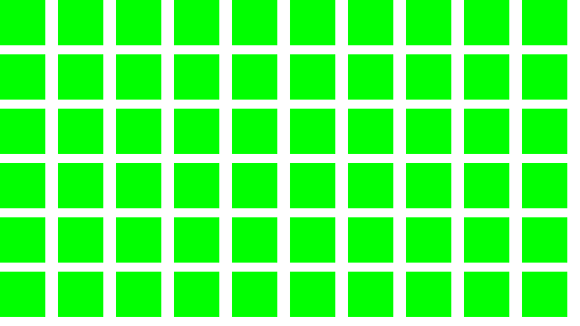
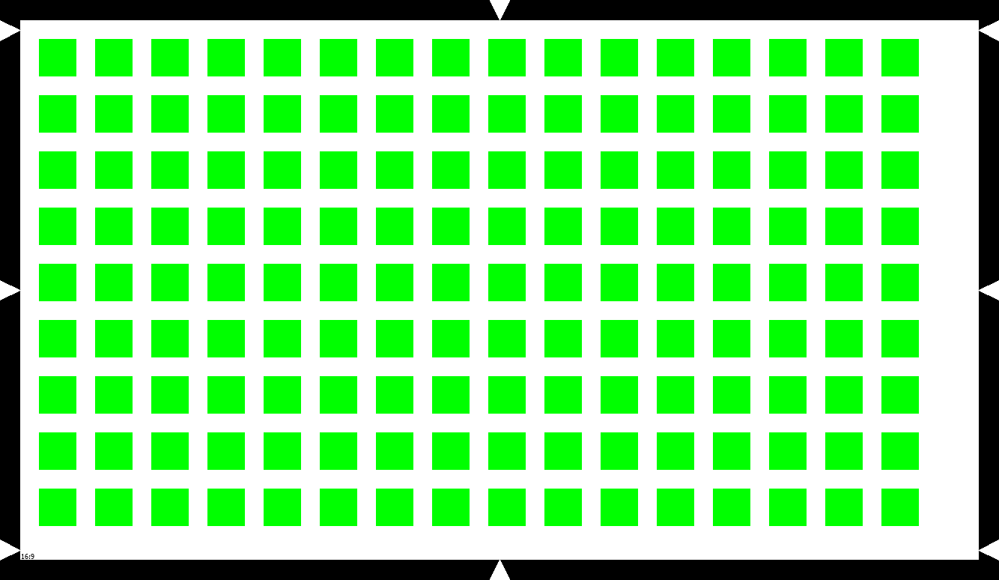
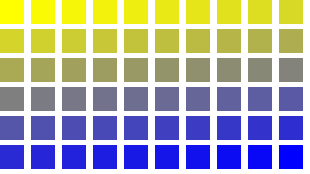
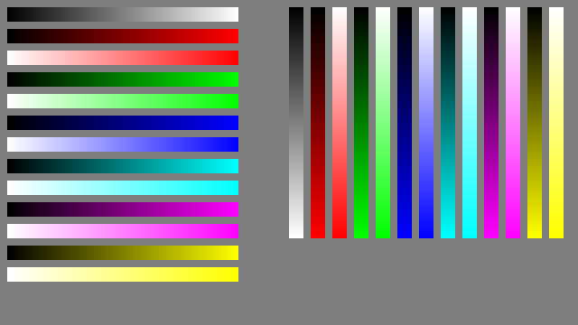
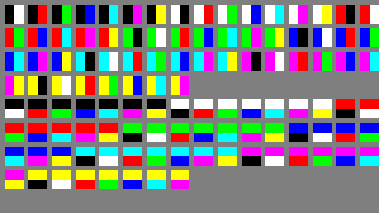
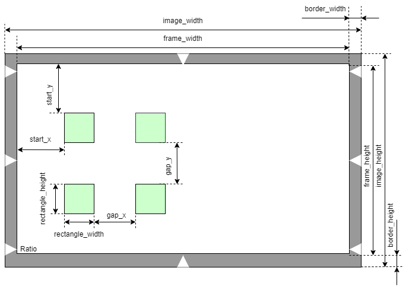

# Leesa

<!---  --->

Leesa is an open-source software for image and video processing.

Contents
========

* [Why?](#why)
* [Usage](#usage)

## Why?

I wanted a tool that allows you to:

+ Test the performance of your demosaic algorithm for a raw image.


## Usage

An example of usage for chart with single color and without border:

``` shell
from leesa.chart import Chart

ct = Chart(frame_type='HD', color_background=(255, 255, 255))
ct.rectangles(color_mode='single_color',
              rectangle_color=[[0, 255, 0]],
              border=False,
              image_name='img/out/single_color.png',
              json_name='img/out/single_color.json')
```
The output image will be:




An example of usage for chart with single color and border:

``` shell
from leesa.chart import Chart

ct = Chart(frame_type='HD', color_background=(255, 255, 255))
ct.rectangles(color_mode='single_color',
              rectangle_color=[[0, 255, 0]],
              border=True,
              image_name='img/out/single_color.png',
              json_name='img/out/single_color.json')
```
The output image will be:



An example of usage for chart with gradient color and border:

``` shell
from leesa.chart import Chart

ct = Chart(frame_type='HD', color_background=(255, 255, 255))
ct.rectangles(color_mode='gradient_color',
              rectangle_color=[[255, 255, 0], [0, 0, 255]],
              border=False,
              image_name='img/out/gradient_color.png',
              json_name='img/out/gradient_color.json')

```

The output image will be:



An example of usage for chart with ramp colors:

``` shell
from leesa.chart import Chart

    ct = Chart(frame_type='nHD', color_background=(127, 127, 127))

    ct.ramps(image_name='img/out/ramps.png',
             json_name='img/out/ramps.json')

```

The output image will be:




An example of usage for converting RGB to Bayer images:

``` shell
from leesa.chart import Chart

    ct = Chart(frame_type='nHD', color_background=(127, 127, 127))

    ct.ramps(image_name='img/out/ramps.png',
             json_name='img/out/ramps.json')
    # for RGGB Bayer type
    rgb_to_bayer(image_name='img/out/ramps.png', dir_name='img/out', bayer_type='RGGB')
    # for BGGR Bayer type
    rgb_to_bayer(image_name='img/out/ramps.png', dir_name='img/out', bayer_type='BGGR')
```
An example of usage for chart with color combinations:

``` shell
from leesa.chart import Chart

    ct = Chart(frame_type='nHD', color_background=(127, 127, 127))
    
    ct.combinations(image_name='img/out/combinations.png',
                    json_name='img/out/combinations.json')

```
The output image will be:



### Chart parameters




### class Chart

Parameters:

|name        |type  | meaning                                                           |
|------------|------|-------------------------------------------------------------------|
|frame_type  | str  | frame type                                                        |
|color_background  | tuple  | color as RGB list, be default is [0, 0, 0]                        |


Accepted frame_type resolutions:

|name               | Resolution (WxH) | Ratio |
|-------------------|------------------|-------|
| QQVGA       | 160, 120        |   4:3    |
| SXGA        | 1280, 1024        |   5:4    |
| XGA         | 1024, 768        |   4:3    |
| SXGAminus   | 1280, 960        |   4:3    |
| s2592   | 2592, 1944        |   4:3    |
| WXGA_1152   | 1152, 768        |   3:2    |
| WXGA_1280   | 1280, 800        |   16:10    |
| nHD  | 640,	360 | 16:9|
| HD   | 1280, 720        |   16:9    |
| FHD   | 1920, 1080        |   16:9    |
| s1440   | 1440, 720        |   18:9    |
| s2560   | 2560, 1080        |   21:9    |

### function Chart.chart_rectangles

Create chart and save image and JSON files.

Parameters:

| name             |type  | meaning                                                                                                                           |
|------------------|------|-----------------------------------------------------------------------------------------------------------------------------------|
| color_mode       | str  | 'single_color' - all rectangles will be same color, 'gradient_color' - colors will be interpolated between first and last colors. |
| rectangle_color  | list  | color as RGB list, for 'single_color' - [R, G, B], for 'gradient_color' - [[R0, G0, B0], [R1, G1, B1]]                            |
| rectangle_width  | int  | rectangle width                                                                                                                   |
| rectangle_height | int  | rectangle height                                                                                                                  |
| start_x          | int  | an x offset to start first rectangle from the left top corner                                                                     |
| start_y          | int  | an y offset to start first rectangle from the left top corner                                                                     |
| gap_x            | int  | x distance between 2 rectangles                                                                                                   |
| gap_y            | int  | y distance between 2 rectangles                                                                                                   |
|border      | bool  | FALSE or TRUE; draw border and pointers                                                                                           |
| image_name       | str  | image file name to save                                                                                                           |
| json_name        | str  | json file name to save                                                                                                            |
