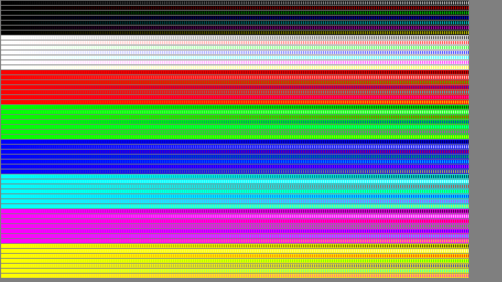
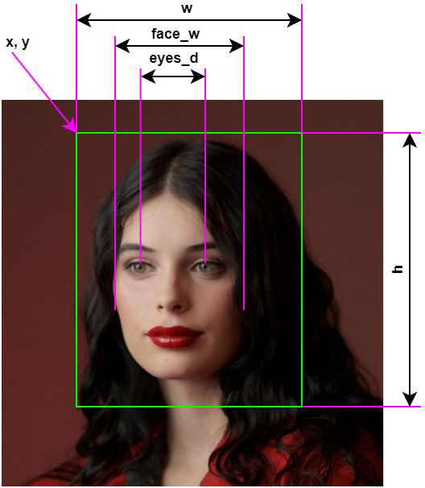
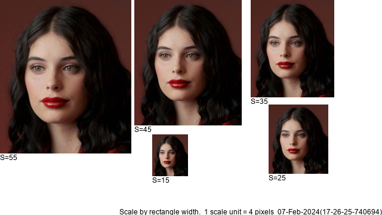

# Leesa

<!---  --->

Leesa is an open-source software for image and video processing.

Contents
========

* [Why?](#why)
* [Resolution](#resolution)
* [Usage for demosaic chart creation](#usage-for-demosaic-chart-creation)
* [Usage for edge chart creation](#usage-for-edge-chart-creation)
* [Data preparation for face object](#data-preparation-for-face-object)
* [Usage for object detection chart creation](#usage-for-object-detection-chart-creation)

## Why?

I wanted a tool that allows you to:

+ Test the performance of your demosaic algorithm for a raw image.
+ Test the performance of your edge detection algorithm for a rgb image.
+ Test the performance of your face detection algorithm for a rgb image.

## Resolution

Accepted frame_type resolutions:

|name               | Resolution (WxH) | Ratio |
|-------------------|------------------|-------|
| QQVGA       | 160, 120        |   4:3    |
| SXGA        | 1280, 1024        |   5:4    |
| XGA         | 1024, 768        |   4:3    |
| SXGAminus   | 1280, 960        |   4:3    |
| s2592   | 2592, 1944        |   4:3    |
| WXGA_1152   | 1152, 768        |   3:2    |
| WXGA_1280   | 1280, 800        |   16:10    |
| nHD  | 640, 360 | 16:9|
| HD   | 1280, 720        |   16:9    |
| FHD   | 1920, 1080        |   16:9    |
| s1440   | 1440, 720        |   18:9    |
| s2560   | 2560, 1080        |   21:9    |

## Usage for demosaic chart creation

An example of usage for chart with single color and without border:

``` shell
from leesa.chart import Chart

ct = Chart(frame_type='HD', color_background=(255, 255, 255))
ct.rectangles(color_mode='single_color',
              rectangle_color=[[0, 255, 0]],
              border=False,
              image_name='img/out/single_color.png',
              json_name='img/out/single_color.json')
```

The output image will be:


An example of usage for chart with single color and border:

``` shell
from leesa.chart import Chart

ct = Chart(frame_type='HD', color_background=(255, 255, 255))
ct.rectangles(color_mode='single_color',
              rectangle_color=[[0, 255, 0]],
              border=True,
              image_name='img/out/single_color.png',
              json_name='img/out/single_color.json')
```

The output image will be:


An example of usage for chart with gradient color and no border:

``` shell
from leesa.chart import Chart

ct = Chart(frame_type='HD', color_background=(255, 255, 255))
ct.rectangles(color_mode='gradient_color',
              rectangle_color=[[255, 255, 0], [0, 0, 255]],
              border=False,
              image_name='img/out/gradient_color.png',
              json_name='img/out/gradient_color.json')

```

The output image will be:


An example of usage for chart with ramp colors:

``` shell
from leesa.chart import Chart

    ct = Chart(frame_type='nHD', color_background=(127, 127, 127))

    ct.ramps(image_name='img/out/ramps.png',
             json_name='img/out/ramps.json')

```

The output image will be:


An example of usage for converting RGB to Bayer images:

``` shell
from leesa.chart import Chart

    ct = Chart(frame_type='nHD', color_background=(127, 127, 127))

    ct.ramps(image_name='img/out/ramps.png',
             json_name='img/out/ramps.json')
    # for RGGB Bayer type
    rgb_to_bayer(image_name='img/out/ramps.png', dir_name='img/out', bayer_type='RGGB')
    # for BGGR Bayer type
    rgb_to_bayer(image_name='img/out/ramps.png', dir_name='img/out', bayer_type='BGGR')
    # for X-TRANS Bayer type
    rgb_to_bayer(image_name='img/out/ramps.png', dir_name='img/out', bayer_type='X-TRANS')
```

An example of usage for chart with color combinations:

``` shell
from leesa.chart import Chart

    ct = Chart(frame_type='nHD', color_background=(127, 127, 127))
    
    ct.combinations(image_name='img/out/combinations.png',
                    json_name='img/out/combinations.json')

```

The output image will be:


## Usage for edge chart creation

An example of usage for chart for edge detection test:

``` shell
from leesa.chart import Chart

    ct = Chart(frame_type='FHD', color_background=(127, 127, 127))
    ct.edge_test(image_name='img/out/edge_test.png',
                    json_name='img/out/edge_test.json')

```

The output image will be:



### Chart parameters


### class Chart

Parameters:

|name        |type  | meaning                                                           |
|------------|------|-------------------------------------------------------------------|
|frame_type  | str  | frame type                                                        |
|color_background  | tuple  | color as RGB list, be default is [0, 0, 0]                        |

### function Chart.chart_rectangles

Create chart and save image and JSON files.

Parameters:

| name             |type  | meaning                                                                                                                           |
|------------------|------|-----------------------------------------------------------------------------------------------------------------------------------|
| color_mode       | str  | 'single_color' - all rectangles will be same color, 'gradient_color' - colors will be interpolated between first and last colors. |
| rectangle_color  | list  | color as RGB list, for 'single_color' - [R, G, B], for 'gradient_color' - [[R0, G0, B0], [R1, G1, B1]]                            |
| rectangle_width  | int  | rectangle width                                                                                                                   |
| rectangle_height | int  | rectangle height                                                                                                                  |
| start_x          | int  | an x offset to start first rectangle from the left top corner                                                                     |
| start_y          | int  | an y offset to start first rectangle from the left top corner                                                                     |
| gap_x            | int  | x distance between 2 rectangles                                                                                                   |
| gap_y            | int  | y distance between 2 rectangles                                                                                                   |
|border      | bool  | FALSE or TRUE; draw border and pointers                                                                                           |
| image_name       | str  | image file name to save                                                                                                           |
| json_name        | str  | json file name to save                                                                                                            |

## Data preparation for face object

Rename you image (for example: sample_0.jpg). Create the JSON file with same name (for example: sample_0.json).
Add to JSON file the x, y coordinates of the detection rectangle, width and height of the detection rectangle, face width, and distance between eyes.

For example the JSON data will be:
``` shell
[
	{"obj":"face", "x": 672, "y": 42, "w": 970, "h": 1134, "face_w": 460, "eyes_d": 236}
]
```
An image below explains the JSON fields.

An image width will be scaled by using the 'scale' and 'scale_size' parameter and . 
For example: 'scale' = 10 and 'scale_size' = 4, the calculation is: 'detection rectangle width' = 'scale' * 'scale_size' = 10 * 4 = 40

The 3 modes for scaling is used (parameter 'scale_mode'):
* 0 - scale by detection rectangle width or 'w'
* 1 - scale by width of the face or 'face_w'
* 2 - scale by distance between eyes or 'eyes_d'



## Usage for object detection chart creation

An example of usage for chart for face detection test:

``` shell
from leesa.odchart import ODChart

    ct = ODChart(frame_type='nHD', color_background=(255, 255, 255))
    ct.f_to_one_image(dir_img='tests/data_sample/sample_0/',
                                dir_json='tests/data_sample/sample_0/',
                                dir_out='img/out',
                                scale_size=4,
                                scales= [35, 34, 33, 32, 31, 30, 29, 28, 27, 26, 25, 24, 23, 22, 21, 20],
                                scale_mode=0)

```

The output image will be:



The output JSON file will be:
``` shell
{"exporter":"Leesa Exporter v0.1.6","time":"07-Feb-2024(17-35-26-429641)","type":"object detection",
 "scale_size":4,"detect_type":"face","scale_mode":0,
 "objects":[{"x":0,"y":0,"w":220,"h":257,"scale":55},  {"x":225,"y":0,"w":180,"h":210,"scale":45},
           {"x":420,"y":0,"w":140,"h":163,"scale":35}, {"x":450,"y":175,"w":100,"h":116,"scale":25},
           {"x":255,"y":225,"w":60,"h":70,"scale":15}]
}
```